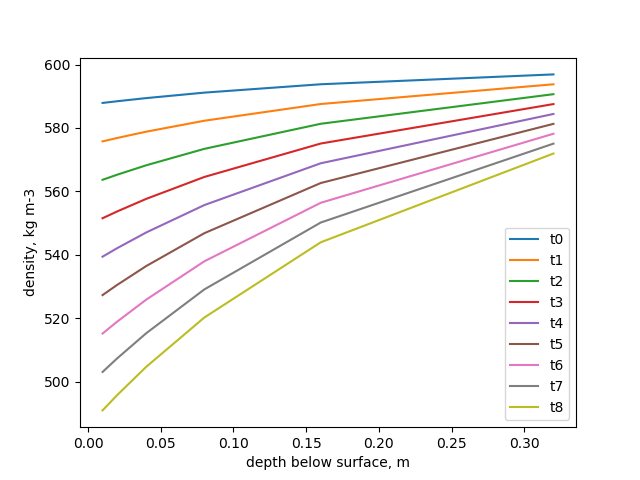

# wc-model

Python implementation a modified version of Schuster's (2001) weatherign crust development model.

## Quick start

Only one package is required that's not bundled in the Python standard library - matplotlib.
Install using `pip install matplotlib`. 

Then run the model from the project root directory using 

```
python main.py
```

This calls the `run_model()` function with the default config. You can change the config to alter how the model runs.

The default config has the `csv` parameter set to False, which means the model gets all its input data from the `inputs` dictionary defined in `inputs.py`. You can adjust the values in there as you see fit. This mode of operation should be sufficient if you are only doing single model runs or have coarse resolution data that you want to update manually.


## Met data

Often, you'll want to input data from a csv file. In this case, set `csv` to `True` in the call to `run_model()` and provide a filepath. Your csv file should have a header row and be structured as follows:

| TS  | DOY | TOD | k_star | l_star  | wind_spd | air_temp | rel_hum     |
| --- | --- | --- | ------ | ------- | -------- | -------- | ----------- |
| 0   | 217 | 0   | 10.85  | -56.475 | 2.71     | 0.73     | 0.850775    |
| 1   | 217 | 100 | 1.082  | -42.03  | 3.18     | 0.2      | 0.867466833 |
| 2   | 217 | 200 | 1.322  | -39.269 | 3.16     | 0.17     | 0.879960833 |

...

Your function call will look as follows:

`outputs = run_model(inputs, 1,10,1, Truee, '/home/Desktop/met-file.csv')`

## Modification from the Schuster model

We attempted to provide a faithful implementation of the Schuster (2001) model but the thesis where it is described lacks descriptions of some steps that I believe to be required for the model to yield density profiles in correct units.

Specifically, the equations 4.4 and 4.5, calculating Mi and Ma (mass loss due to internal weathering and mass loss due to ablation) are incomplete. In order to yield mass loss in kg, we replace the original equations with new ones.

The originals are

```
Mi = Qmi  / P * Lf

Ma = Qma / P * Lf
```

where Qmi = energy available for internal melting in Wm-2, Qma = energy available for surface melting in Wm-2, P = density of ice in kg m-3, Lf = latent heat of fusion for ice at 0 C (333700 J kg-1).

The updated equations are:

```
Ma = m * (Qma / m * Lf)
Mi = m * (Qmi / m * Lf)
```

Where m = mass of ice layer in kg, Qmi = energy available for internal melting in Wm-2, Qma = energy available for surface melting in Wm-2, , Lf = latent heat of fusion for ice at 0 C (333700 J kg-1)

Ma and Mi then represent the mass of ice lost to ablation.


We also consider the extinction coefficient reported in the paper of 0.006 m-1 to be several orders of magnitude incorrect. We think a more appropriate value for a wavelength-integrated extinction coefficient should be more like 1-5 m-1. We chose to set the default extinction coefficient to 2 m-1 here, as this seems like an appropriate estimate based on Fig 3 of [Grenfell and Maykut 1977](https://www.cambridge.org/core/services/aop-cambridge-core/content/view/EE9874935EE49EB944960B83BC53397C/S0022143000021122a.pdf/optical_properties_of_ice_and_snow_in_the_arctic_basin.pdf).


## Outputs

Your output data is structures as an array of dicts, with each dict containing a snapshot of the ice properties for each timestep. Each dict contains the following key/value pairs:

```
# these are set in inputs.py and updated each timestep
"layer_thicknesses" : [0.01, 0.02, 0.04, 0.08, 0.16, 0.32], # meters
"area_w": 1, # m
"area_l": 1, # m
"dense_ice_constant": 890, # what density to use for underlying unweathered ice
"extinction_coefficient" : 3, # m
"k_star" : 380, # Wm-2
"delta_t" : 3600, # seconds
"densities" : [600, 600, 600, 600, 600, 600], # kgm-3
"lf" : 333700, # J kg-1
"l_star" : 100, # net long wave radiation
"qh" : 60, # turbulent sensible heat flux density
"qe" : 60 # turbulent latent heat flux density

# these are created and added to each dict at runtime
"n_layers": 6 # number of ice layers 
"volumes": [0.01, 0.02, 0.04, 0.08, 0.16, 0.32] # volume of each layer
"masses": [0.6, 0.12, 0.24, 0.48, 0.96, 192] # mass of each layer in kg
"total_depth": # sum fo layer thicknesses
"k": [90, 80, 70, 60, 50, 40] # solar energy avaiolable at each layer in Wm-2
```

By default the model prints the densities in each layer to the console in each timestep, and plots the density profile for all timesteps in a figure.

The plot looks something like this:


